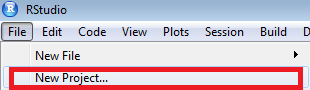
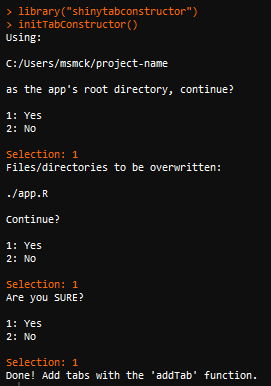
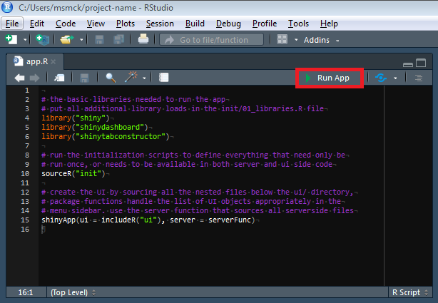
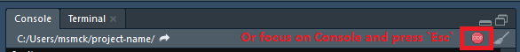
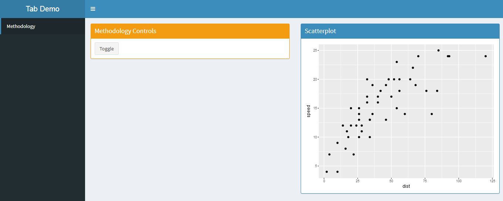
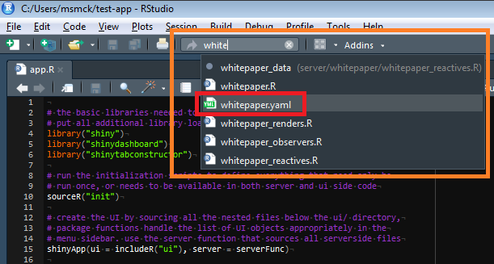
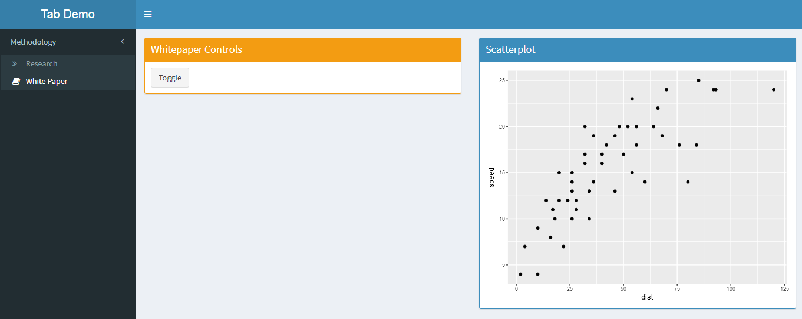
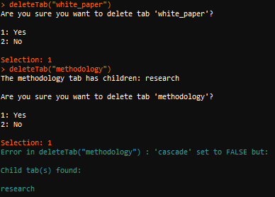
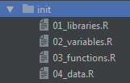

# Organizing Shiny Tabs

## Motivation

What are initially thought to be small shiny projects produced for proofs of concept
often outgrow their original intended purpose and become complex code bases. The code
can also be rather unorthodox as newer Shiny developers usually aren't aware of 
established conventions and/or best practices. In this case just understanding 
what the app is supposed to do can be a challenge.

This package aims to take a lot of that decision making out of the hands of the
developer, letting the physical structure of the file system dictate the organization
of the Shiny tabs. While opinionated, this method greatly simplifies code bases
so that the code is much more readable on the UI side.

Standardization is also a key goal -- the code that is written will be
more easily understood by other developers.

## Quick Start

```r
library("shinytabconstructor")
library("shiny")
initTabConstructor()            # initialize the file system conventions
runApp()                        # run the empty app
```

Then,

```r
addTab('help', open = TRUE)             # create a tab and open all associated files
addTab('contact', 'help', open = FALSE) # create a 'child' of the 'help' tab
runApp()                                # see your creation!

deleteTab('help')                       # delete the tab & files
```

## Installation

**NOTE:** To install from source you'll need to [register your SSH keys](http://csmrnd01.infores.com:3000/CSM/register-ssh-keys):

```r
# For Windows only
devtools::install_git("http://csmrnd01.infores.com:3000/CSM-RND/shinytabconstructor.git")
```

I've already installed the package on `csmrnd01`'s system library and on
the mapr03r cluster in my personal library:

```r
.libPaths("/mapr/mapr03r/analytic_users/msmck/usr/local/lib/R")
library("shinytabconstructor")
```

## Walk-Through

#### 1. Create A Project

Create the Shiny Web App project in the usual way:




#### 2. Initialize the Framework

We'll need to initialize the framework before we can add any tabs.
It will overwrite the `app.R` file as well as the `ui/` and `server/`
directories. It will ask you multiple times if this is really what you
want to do. Type the command in the Console window. 



#### 3. Run the App

If you initialized the framework within an existing project make sure to start a new session (click the power icon in the upper right corner of the RStudio Webserver or type `q()` on the Console window).

You're ready to go! The app will run (and be empty). You can run the app by pressing Ctrl + Shift + Enter when focused in the `app.R` script or type:

```r
library("shiny") # if you haven't already
runApp()         # working directory needs to be in the top level of the project
```

Or click:



What it will look like while empty:


#### 4. Stop the App

You can stop the app by clicking the Stop button or clicking in the console and hitting `Esc`.



#### 5. Create a Tab

Now the fun part. You can use the built in functions to construct tabs.
For instance lets add a `methodology` tab. The names must be valid R object names (alpha-numeric and underscores, with leading letter).

Run in the Console:

```r
# if no parent is specified, it creates the tab at the top level
addTab("methodology")
```

This will open all of the files that pertain to that tab.


We've got a folder on the server side, `server/methodology` in which
we've got separate files for the observers, renders and reactives.
This is a mutually exclusive and collectively exhaustive list! If the way you've solved your problem involving server side code uses a method that isn't a `reactive`, `observer` or `render` (and thus goes in one of these files) you should reconsider the solution.

On the ui side we can see that there is an R script and a .yaml script.
The R script defines the actual structure of the ui whereas the .yaml
signifies to the package that the tab should be included. If there is
a directory with an .R file but no .yaml then it will not be included.
Don't make a habit of this -- if the code is not included in the app then it shouldn't be in that directory!

We've populated some example elements to help you get started.

Run in the Console:

```r
library("shiny") # if you haven't already
runApp()
```



#### 6. Create Nested Tabs

Here's where the power of `shinytabconstructor` comes in. We'll create some nested tabs and keep the code simple.

Make sure you've stopped the app by clicking the stop sign icon or hitting "Esc" after focusing on the Console. Then, run in the Console:

```r
# add the 'research' tab under the 'methodology' tab
addTab('research', 'methodology', open = FALSE)

# add the 'white_paper' tab under the 'methodology' tab
addTab('white_paper', 'methodology', open = FALSE)
```

Alright, so what does the app look like now?


Notice that we have two new server folders with their component pieces. We keep these flat under `server/` because there isn't any hierarchical nature to the server side code.

Notice that on the ui side there _is_ a hierarchical nature. That's
because we use handy recursive programming to construct the menu and
that's how we can represent the structure and keep the code organized
at the same time.

Here's what the app looks like now:


But wait, what happened to our `methodology` tab content? Don't worry,
the source code is still there but because of the way the menu is
set up only the leaf levels have content pages.

And wait, since the `research` tab is showing why isn't the sidebar menu opened with the `research` tab selected? The reason is this is the default action, but it is something we can configure. We'll learn how in the next section.

#### 7. Configuring the Sidebar Menu

Since the sidebar menu is created programmatically using the hierarchical structure of the `ui/body/tabs` directory we can't pass it parameters directly in a function call.

Instead, the constructor allows you to configure these things in [YAML](http://yaml.org/) (YAML Ain't Markup Language) with simple syntax.

Let's configure the `white_paper` tab, first open its YAML file, the easiest way is using the "Go to file/function" search:



Some key "gotchas":

* There must be a space between the colon `:` and the value, declarations like `attribute:value` are invalid. If you violate this you'll see something like: `Error in yaml.load(string, error.label = error.label, ...) : <...> Scanner error: mapping values are not allowed in this context <...>`
* There must be a newline at the end of YAML files (press enter at the end of the last liine of text) otherwise you'll see a message like: `Warning in readLines(file) : incomplete final line found on 'ui/body/tabs/methodology/methodology.yaml'`

We'll add some options (demonstrating with the `ifelse` that you can run R code there if needed):


And to the parent's YAML (`methodology.yaml`) too:


Save and run the app:



Great! You can customize in any way you normally would.

#### 7. Removing Tabs

Right, so there are a lot of files associated with each tab, part of the price of trying to keep everything organized -- removing a tab seems like a bear. Not to worry, we're here to help. Use the `deleteTab` function (not to be confused with `shiny::removeTab`, a reactive function).

The function is smart and will both ask you to confirm deletion and detect if there are any files (tabs or otherwise) below them.



Notice the function notified that there were child tabs, if you want to delete those too, then specify `cascade = TRUE` in the function call:


#### 8. Static Variables, Functions & Data

To keep things organized we put one time library loads, variable definitions, function definitions and data loads in a separate place. The initialization will create the `init/` directory with the following files:



Anything that needs to be run only once or needs to be available in both the ui and server side code should be put in the appropriate files.

#### 9. Including Images, Custom CSS and Javascript

The initialization process will also copy the `www/` directory and populate some demo scripts to include and how to include them in the `ui/body/ui.body.R` script.


#### 10. Get Building!

Check out the rest of the capabilities of [Shinydashboard](https://rstudio.github.io/shinydashboard/).